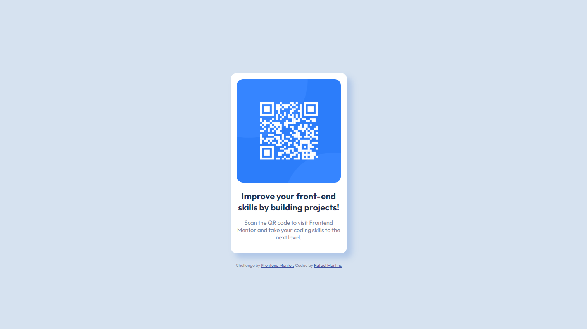

# Frontend Mentor - QR code component solution

This is a solution to the [QR code component challenge on Frontend Mentor](https://www.frontendmentor.io/challenges/qr-code-component-iux_sIO_H).

## Table of contents

- [Overview](#overview)
  - [Screenshot](#screenshot)
  - [Links](#links)
  - [My process](#my-process)
  - [Built with](#built-with)
  - [What I learned](#what-i-learned)
  - [Continued development](#continued-development)
  - [Useful resources](#useful-resources)
  - [Author](#author)

---

## Overview

I've been studying HTML and CSS for the past 3 months and I realized that I wasn't really practicing and when I tried to build something I would simply forget everything I learned. Because of that I decided to spend the next few months just doing challenges and practicing.

This is the easiest challenge on Frontend Mentor but it wasn't that easy for me. Doing things for the first time is never easy so what I decided was to build this challenge as many times as possible until I was comfortable with it and then do it on my own so here we are.

This is the first time doing this challenge completely on my own and trying to use git as well.

Thanks for reading this :D

---

### Screenshot

My Final Design

---

### Links

- Github | Solution URL: [Add solution URL here](https://github.com/Rafaelbpm/frontendmentor-qr-code)
- Live Site URL: [Add live site URL here](https://rafa-qr-code.netlify.app/)

---

## My process

1 - Take a look in the project as a whole
2 - Identifying the key elements to the project
3 - Organize the project folder
4 - Organize all the assets into the right folders
5 - Look and study the style-guide
6 - Initiate GIT repo
7 - HTML
8 - CSS
9 - Prepare README file.
10 - Upload project.
11 - Add project to a live site server.
12 - Share with the community and get feedbacks.
13 - Improve project based on constructive feedbacks.

---

### Built with

- Semantic HTML5 markup
- CSS custom properties
- Flexbox
- Mobile-first workflow
<!-- - [React](https://reactjs.org/) - JS library
- [Next.js](https://nextjs.org/) - React framework
- [Styled Components](https://styled-components.com/) - For styles -->

---

### What I learned

---

### Continued development

Areas that I need to improve and practice more:

- Starting a repository on Github.
- Aligning items in Flexbox.
- Centering a DIV.
- Box Shadows.

---

### Useful resources

- Kevin Powell [Hosting my site with Netlify](https://www.youtube.com/channel/UCJZv4d5rbIKd4QHMPkcABCw) - Kevin is one of the best YouTuber's out there. In this particular project, he helped me to understand how to deploy my website on Netlify.

- Youtube Channel - [Dev World](https://www.youtube.com/channel/UCrm-HTaESqxJXyxMcZFOHng) For helping with Git, Github and Branches.

---

## Author

- Linkedin - [Rafael Martins](https://www.linkedin.com/in/rafaelbpm/)
- Frontend Mentor - [@rafaelbpm](https://www.frontendmentor.io/profile/Rafaelbpm)
- Twitter - [@yourusername](https://www.twitter.com/yourusername)
- Behance - [Rafael Martins](https://www.behance.net/rafaelBPM)

---
